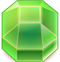
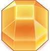

# Arcade Game

This project is a part of [Front-End Web Deveveloper](https://www.udacity.com/course/front-end-web-developer-nanodegree--nd001) course. Project contains frogger-like game, where player need to cross the area without hitting an enemy.

## Getting Started
Use browser to open the [index](index.html) file and play the game.

## Prerequisites
Project is made of pure HTML / CSS / JS files, so there is no special prerequisites and it could be run just in a browser. However, JavaScript files use ES6 syntax, so you need to keep in mind, whether your browser supports ES6 syntax. For *best user-experience* use the *Firefox Browser* - it has smoother animation frames.

## Instructions
Game provides main screen with 'How To Play' button where game features are briefly described.
For more information read the rules below.

## Game Rules
The main goal of the game is to collect as much scores as possible. Player starts with 3 lives, which can be observed as 'Heart' emoji at the top-right corner. The game generates a road to the other side where target cell (checkpoint) is highlighted with yellow texture. Player have to move to the other side, following the generated path and avoiding collision with an enemy. Player can move only by the brick tiles, and can't walk by a grass.

Player has initial 50% chance to spawn an additional bonus on one of 4 predefined tiles, but it's not guaranteed that road will have connection with that tiles, so player should advance to a next level to have luck road passing nearby the bonus. Each bonus has it's own affect described in the table bellow.
 
 Here you can find a table of in-game objects:
 
 Name        | Affect      | Image
 ------------|-------------|------
 Enemy       | -1 life / death | 
 Checkpoint  | +100 points +next level +1% bonus chance | 
 Blue Gem    | +300 points | 
 Green Gem   | +400 points | 
 Orange Gem  | +500 points | 
 Extra Life  | +1 life  no max limit | 
 
Game designed to have unlimited number of levels, where each level adds a complexity. When play reaches the checkpoint, level of the game increases, as well as it's complexity. With each level number of enemies increases and enemies become faster, but player get +1% to spawn a bonus, which may be a 'Gem' or 'Extra Life', so player can accumulate life for late-time game.

## Controls
- WASD or arrow keys to move character via keyboard 
- point & click to move character by 1 cell in mouse direction
- touch & hold to continuously move character to pointer or touch position

## Project Structure
#### [engine.js](js/engine.js)
Core of the game, provides ECS (Entity Component System) architecture, where `Actor` is an entity and `Stage` is the world where actor lives.

Component has following callbacks, appearing in order below:
- `awake` - component created and added to an actor
- `enable` - component has been enabled (called jus after `awake`)
- `start` - occurs just before component receives first update
- `update` - occurs every frame while component enabled
- `lateUpdate` - occurs every frame after `update` while component enabled
- `disable` - when component has been disabled
- `destroy` - when component or containing `Actor` has been destroyed
 
For more information google for ECS or [related artcles](https://www.gamedev.net/articles/programming/general-and-gameplay-programming/understanding-component-entity-systems-r3013/)

#### [components.js](js/components.js)
Provides set of commonly used components, which are not bound to a game logic. Also includes resource loader (`Resources`).

#### [systems.js](js/systems.js)
Systems that make components alive. Each system serves callbacks only for specific component type, where:
- `UpdateSystem` invokes `update` to move objects and do primary calculations
- `LateUpdateSystem` invokes `lateUpdate` to move apply secondary calculations before drawing objects 
- `DrawSystem` invokes `draw2D` to draw the game
- `GizmoSystem` invokes `drawGizmo2D` to draw the debugging geometry
 
#### [physics.js](js/physics.js)
Provides set of components and system for collision detection:
* `PhysicsBody2D` body which may contain multiple colliders
* `CapsuleCollider2D` collider defining a capsule shape of a collider
* `CollisionSystem2D` sends notifications to `PhysicsBody2D`:
    * `enter` when objects collision started this frame
    * `stay` when objects collision continues from previous time
    * `exit` when objects no more have collision

`PhysicsBody2D` at the same time dispatch callbacks to all attached components by invoking:
* `triggerEnter2D` on `enter` notification
* `triggerStay2D` on `stay` notification
* `triggerExit2D` on `exit` notification
     
#### [ui.js](js/ui.js)
Contains set of dialogs used within the game, like stats, main menu scree, instruction, etc.

#### [game.js](js/game.js)
Contains all of the game related logic via components like enemy, bounty, terrain, player, player-controller, etc. 

## Contributing
Project has strictly education purposes and will no accept any pull requests.

## Authors
* **[Max Stankevich](https://github.com/gavar)**

## License
This project is licensed under the MIT License - see the [LICENSE](LICENSE.md) file for details
